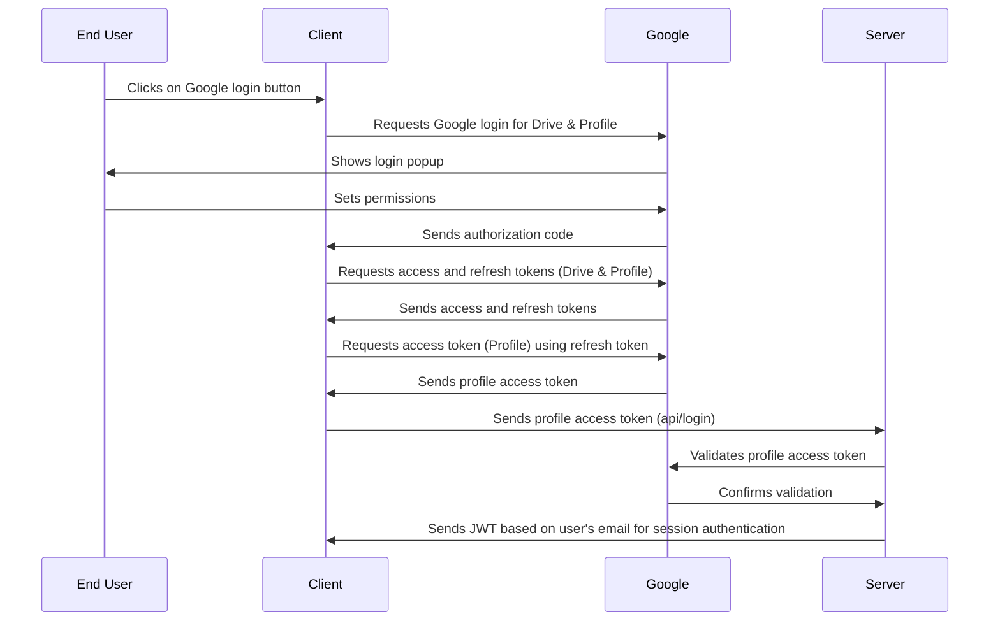
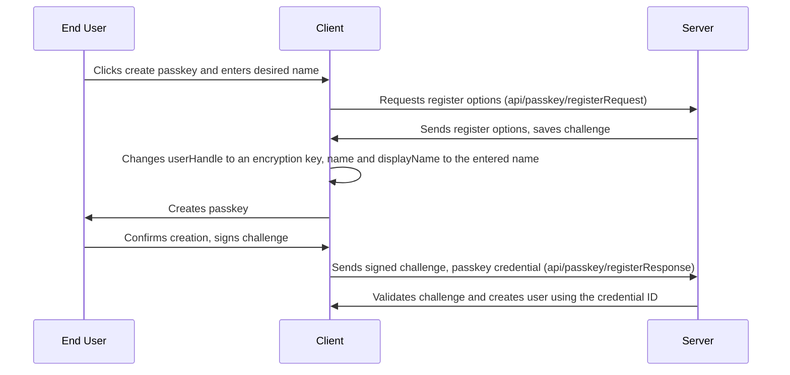
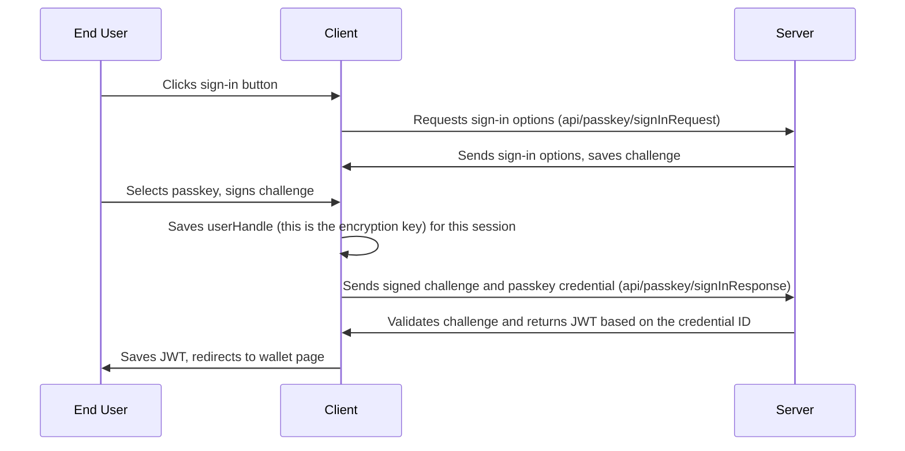
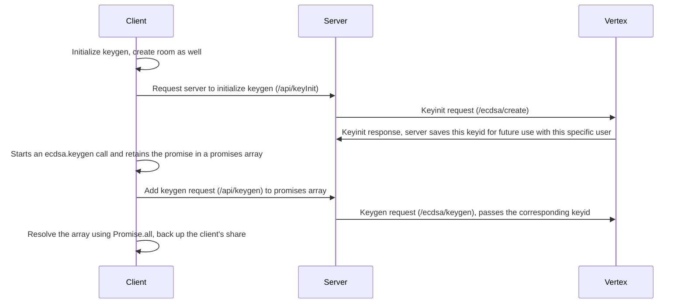
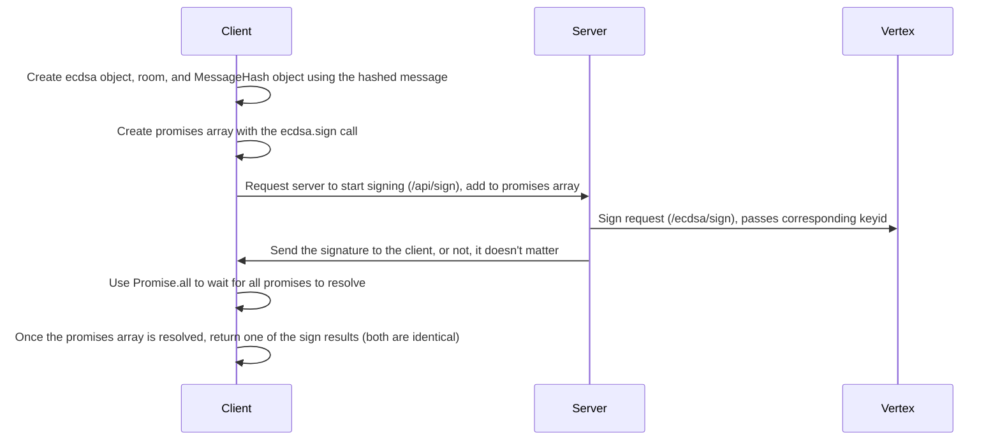
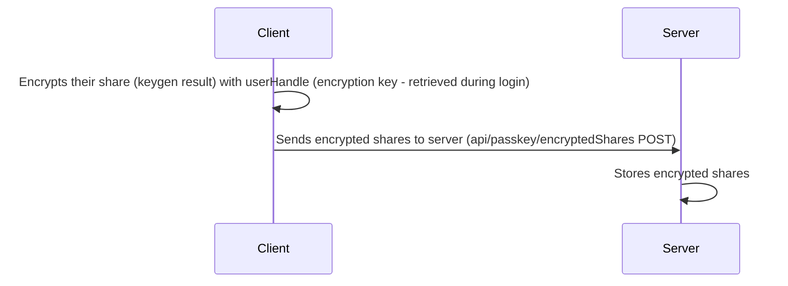
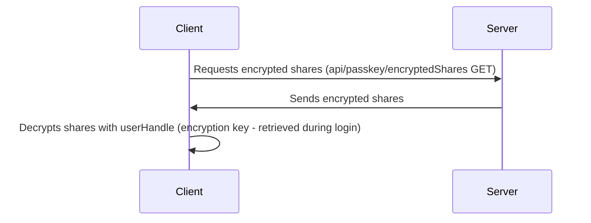

# Sodot Wallet Demo

A live version of this demo is hosted at: [wallet-demo.sodot.dev](https://wallet-demo.sodot.dev/)

## Decription

This project demonstrates how to create a web-based wallet application utilzing MPC and Passkeys (or Google Login). The project uses the Sodot MPC SDK and Vertex as its key management infrastructure. The application allows users to generate keys, sign Ethereum transactions, and manage their wallet securely. It leverages Next.js and integrates with the Vertex and SDK products for key management and transaction signing.

The aim of this project is to provide a reference implementation for users of Sodot MPC Infrastructure that wish to implement their own "Sign-in with Google" or "Sign-in with Passkeys" onboarding experience for their self-custodial wallets.

### Project Architecture

The project is structured as follows:

1. **Frontend**

   - Built with Next.js, a React framework for server-side rendering and static site generation.
   - Utilizes Mantine for UI components and styling.
   - Implements authentication using Google OAuth and Passkeys.

2. **Backend**

   - Uses Next.js API routes for server-side logic.
   - Integrates with Prisma for database management.
   - Handles key generation and management using the Sodot Vertex (an MPC signer server).

3. **Database**

   - Managed with Prisma and SQLite.
   - Stores user information and metadata.

4. **Key Management and Signing**

   - Sodot MPC SDK is used for key generation and MPC signing on the client side.

   - Sodot MPC Vertex is used for secure key share storage and MPC signing on the server side.

   - 2 out of 2 Signing - 1 share with the SDK on the client side and 1 share with the Vertex on the server side.

## Client Key Share Backup and Authentication

The project shows utizing either Google or Passkeys for user authorization and client key share backup.

1. **Google**: This method uses Google Drive to store the backup of the client's shares. The shares are uploaded to the user's Google Drive account, ensuring that they can be recovered if needed. Additionally, the Google login session is used to authenticate the user.

2. **Passkeys**: This method uses Passkeys to encrypt and store the backup of the client share. The encrypted share is stored on the server, and the Passkey is used to decrypt them in-memory on the client side when needed. The encryption prevents the server from accessing the client share. The Passkeys are also used as the authentication method.

## Running The Project Locally

First, define a .env file as shown in Step 2 of the guide below.

Then, run:

`npm run db::init` (only required before the first run of the webapp)

`npm run dev`

## Build Docker Image

In case you wish to run the webapp as a docker image, we provide a Dockerfile that you can use with the following arguments:

(Note: You should delete the `prisma/dev.db` file before building the image)

```
docker build \
--build-arg "NPM_TOKEN=..." \
--build-arg "SERVER_API_KEY=..." \
--build-arg "VERTEX_URL=..." \
--build-arg "JWT_SECRET_KEY=..." \
--build-arg "RP_ID=..." \
--build-arg "RP_NAME=..." \
--build-arg "ORIGIN=..." \
--build-arg "DATABASE_URL=..." \
--build-arg "ETH_NET_URL=..." \
--build-arg "NEXT_PUBLIC_GOOGLE_AUTH_CLIENT_ID=..." \
--build-arg "NEXT_PUBLIC_GOOGLE_AUTH_CLIENT_SECRET=..." \
--build-arg "NEXT_PUBLIC_GOOGLE_AUTH_REDIRECT_URI=..." \
-t wallet-demo .
```

Replace the "..." with the corresponding values from your .env file.

You may also need to add the --platform linux/amd64 flag for deployment.

## Step-by-Step Guide For Recreating This Project

## 1. Create a Next.js application

## 2. Create .env and consts.ts files:

For this project, you will need to set some environment variables.  
We recommend creating a `.env` file at the root of your project. The `.env` file should contain the following variables:

```.env
# Token to access the Sodot Web SDK
NPM_TOKEN=<your sodot sdk npm token>

# Sodot Vertex API key
SERVER_API_KEY=<your vertex server api key>

# Sodot Vertex URL
VERTEX_URL=<your vertex url (e.g. vertex-demo-0.sodot.dev)>

# JWT secret key for user authentication against the server
JWT_SECRET_KEY=<jwt secret key for user authentication against the server (e.g. "s3Cr3t78139381!")>

# For passkey sign-in and registration
RP_ID=<set to "localhost" locally or your domain in production (without "https://")>

# For passkey registration
RP_NAME=<choose desired name (e.g Wallet-Demo) >

# For passkey registration and sign-in
ORIGIN=<set to "http://localhost:3000" locally or your domain in production (with "https://")>

# Database URL for Prisma (e.g., file:./dev.db)
DATABASE_URL=<your database url for prisma>

# Ethereum net URL (e.g., https://sepolia.infura.io/v3/PROJECT_ID)
ETH_NET_URL=<your ethereum net URL>

# Google auth
NEXT_PUBLIC_GOOGLE_AUTH_CLIENT_ID = <your google client id>;

# Google auth
NEXT_PUBLIC_GOOGLE_AUTH_CLIENT_SECRET = <your google client secret>;

# Google auth
NEXT_PUBLIC_GOOGLE_AUTH_REDIRECT_URI = <just like origin>
```

Check out `consts.ts` - this file exports the env variables for this project and declares other useful constants.

## 3. Authentication

### A. Google

For more info, refer to `app/ui/googleLoginComponent.tsx` (client) and `app/api/login.ts` (server).

To implement Google-based authentication, we use two separate access tokens:  
One for Google Drive and one for the Google Login Profile.  
The Drive token is used to upload the client share to the user's Google Drive account, while the Profile token is used only to verify the user's identity with the server.  
This ensures that the server can verify the user's identity without gaining access to the client share in Google Drive.  
**Note: The user's email address will be used to identify the user.**  
Backing up the client share using Google Drive will be explained later.

**Important:**
`Client Secret` is used in the client side as it's the only way to ensure authentication against the server and google drive permission in one click.
If you do not want to expose your `client secret` or you already authonticated against the server, use this [flow](https://developers.google.com/identity/protocols/oauth2/javascript-implicit-flow) instead (Get access token for profile and drive separately).

Google login flow:



### B. Passkeys

For more info, refer to `app/passkey/index.ts` (client) and `app/api/passkey/registerRequest`, `app/api/passkey/registerResponse`, `app/api/passkey/signinRequest`, `app/api/passkey/signInResponse` (server).

Passkeys will be used for user authentication with the server as well as client share backup.  
Authentication will be based on the credential ID field.  
Backup - the client share will be encrypted using the Passkey and stored encrypted on the server (meaning the server can't access the client share). The Passkey will be used to decrypt the shares in-memory when needed.  
**Note: The Credential ID field of the Passkey will be used as the identifier for the user.**  
Backing up the client key share using the Passkey will be explained later.

Create Passkey flow:



Sign-in with Passkey flow:



## 4. MPC

### A. Keygen

For full details, refer to `app/mpc/keygen.ts` (client) and `app/api/keyInit`, `app/api/keygen` (server).

The flow:



### B. Sign

For full details, refer to `app/mpc/signMessage.ts` (client) and `app/api/signMessage` (server).  
Note that we assume the message is already hashed.

The flow:



## 5. Key share backup

## A. Google drive

For more info go to `app/keyBackup/keyBackup.ts`

## 1. Backup Shares

Use this function:

```typescript
async function createFileWithFetch(
  accessToken: string,
  fileName: string,
  jsonData: EcdsaKeygenResult[],
) {
  //for full info go to app/keyBackup/keyBackup.ts
}
```

The function creates a file in the user's Google Drive account with the specified name and content. The file is stored in the App Data folder to ensure privacy and security.

## 2. Retrieve Shares From Backup

Use this function:

```typescript
export async function getBackupFile(
  accessToken: string,
  name: string,
): Promise<EcdsaKeygenResult[] | null> {
  //for full info go to app/keyBackup/keyBackup.ts
}
```

This function retrieves the most recent backup file from the user's Google Drive account and parses the JSON data to extract the keygen result.  
**Use the same file name as the one used in the backup function.**

## B. Passkeys

Code found in `app/keyBackup/keyBackup.ts`

## 1. Backup Shares Using Passkey Flow



## 2. Retrieve Shares From Backup Using Passkey Flow



## 6. ETH Integration

For more info, refer to `app/ethereum/etherUtils.ts`, `app/api/ethereum`.
Use ethers.js to set up a `JsonRpcProvider` object for your desired network.

```typescript
import { ethers } from 'ethers';

const jsonRpcProvider = new ethers.JsonRpcProvider(testnetUrl);
// Use the URL of the network you want to connect to (instead of testnetUrl)
```

**Best practice**:
Interact with the provider on the server side so your API key is not exposed to the client.

**Server responsibilities:**

- Get balance (`app/api/ethereum/balance/route.ts`)
- Get nonce (`app/api/ethereum/nonce/route.ts`)
- Broadcast transaction (`app/api/ethereum/broadcastTransaction/route.ts`)

**Client responsibilities:**

- Build and sign transaction (`app/ethereum/etherUtils.ts/createSignedTransaction`)
- Get address from `EcdsaPublicKey` object (`app/ethereum/etherUtils.ts/addressFromPublicKey`)

### A. Balance

Use this flow (in the server):

```typescript
export async function getBalance(address: string): Promise<string> {
  const balanceWei = await jsonRpcProvider.getBalance(address);
  const balanceEther = ethers.formatEther(balanceWei);
  return balanceEther;
}
```

### B. Send ETH

Use this flow :

```typescript
const nonce = await clientGetNonce(sendAddress);
const txRequest: ethers.TransactionLike<string> = {
  to: receiveAddress,
  value: parseEther(amount.toString()),
  nonce: nonce,
  chainId: getBigInt(11155111),
  type: 2,
  gasLimit: getBigInt(21000),
  maxFeePerGas: getBigInt(34599716012),
  maxPriorityFeePerGas: getBigInt(25302576),
};

//sign the transaction
const txSerialized = Transaction.from(txRequest).unsignedSerialized;

const sig = await signMessage(keccak256(txSerialized));

const signedTx = Transaction.from({
  ...txRequest,
  signature: {
    r: hexlify(sig.r), // Add r, v, and s from the signature
    v: sig.v,
    s: hexlify(sig.s),
  },
});

await clientBroadcastTransaction(signedTx.serialized); //request server to broadcast transaction
```

## 7. Done - Wrap With the UI of Your Choice
